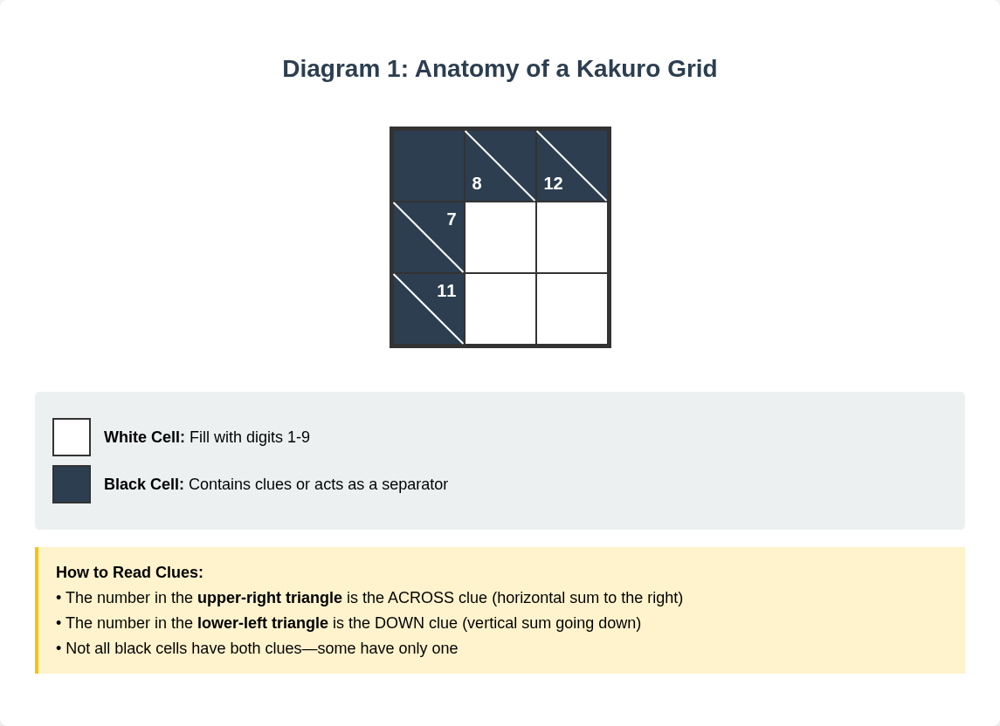
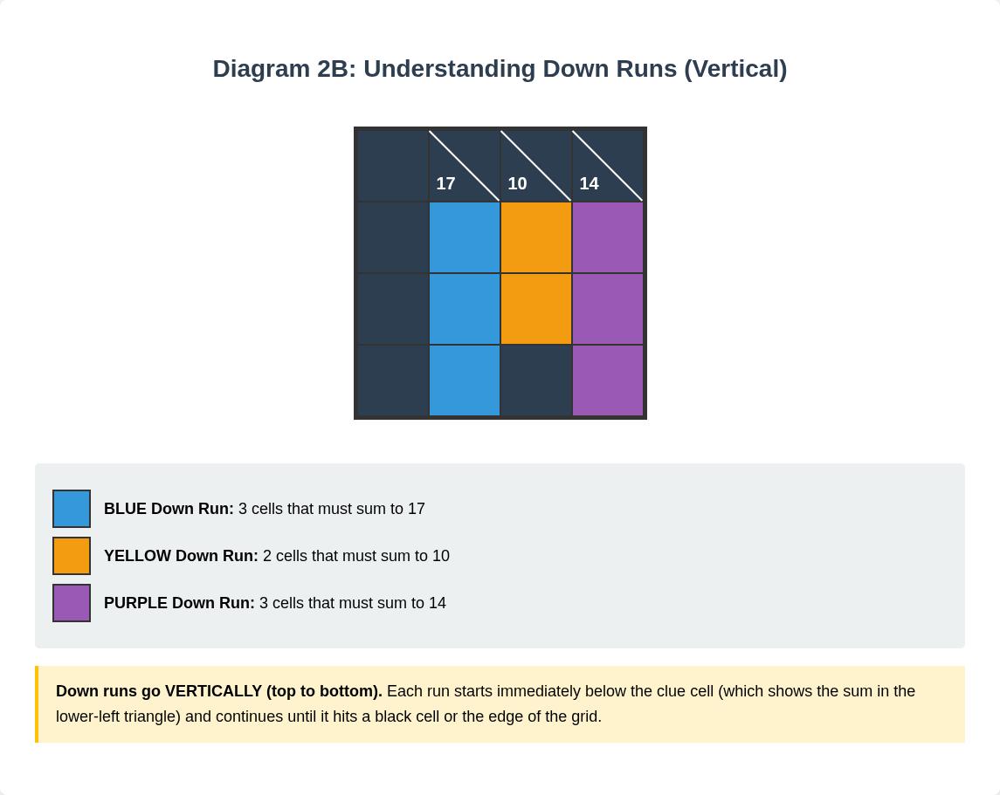
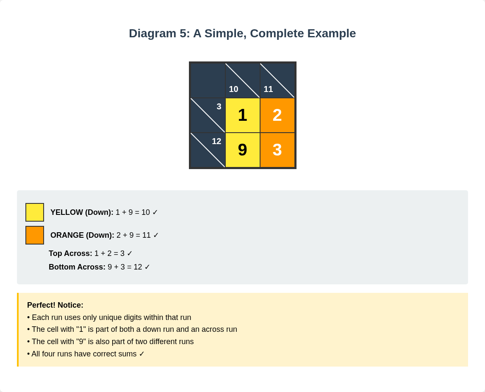

# Chapter 1: Understanding Kakuro

## What is Kakuro?

Sudoku meets crossword.

That's Kakuro in three words.

You fill in numbers. They have to add up. No repeats allowed.

Simple rules. Deep satisfaction.

If you've ever finished a Sudoku and thought, "What's next?"—this is it.

---

### A Brief History

The puzzle showed up in America in the 1960s.

They called it "Cross Sums" back then.

But Japan made it famous. By the 1980s, Kakuro was everywhere in Japanese puzzle magazines—right alongside Sudoku.

The name? It's a Japanese abbreviation.

"Kasan kurosu" = addition cross.

Shortened to Kakuro.

Simple. Elegant. Just like the puzzle itself.

---

### Why Kakuro?

Here's what makes it different from Sudoku:

**Sudoku** = Pattern recognition. Elimination. No math required.

**Kakuro** = Actual addition. Number combinations. Your brain does real work.

That arithmetic element isn't intimidating.

It's satisfying.

You're not just filling in blanks. You're solving something.

---

### What You Need

Here's what you don't need:
- A math degree
- A calculator
- Any special talent

Here's what you do need:
- Basic addition
- A pencil
- Patience

That's it.

---

### The Brain Benefits

Studies show it. Logic puzzles keep your mind sharp.

Concentration improves.
Problem-solving strengthens.
That sense of accomplishment? Real.

In a world of endless scrolling, there's something grounding about pencil on paper.

Working through a puzzle. Thinking clearly. Finishing something.

One puzzle at a time.

---

## The Grid Explained

First glance at a Kakuro grid?

Looks complicated.

It's not.

Once you see the structure, it clicks.

---

### The Basic Pieces

Two types of cells. That's all.

**White cells:** Your blank spaces. Fill these with digits 1-9.

**Black cells:** The walls and clue holders. They tell you what to do.

Think crossword. White cells = answers. Black cells = structure.

---

### Reading the Clues

This is where Kakuro gets clever.

Look at any black clue cell. See the diagonal line?

It divides the cell into two triangles.

**Upper-right triangle:** The ACROSS clue.
Points to the white cells on the right.
Those cells must add up to this number.

**Lower-left triangle:** The DOWN clue.
Points to the white cells below.
Those cells must add up to this number.

*White cells, black cells, diagonal lines—and how to read across clues (upper-right) vs. down clues (lower-left).*

Example:
- Black cell shows "17" in upper-right
- The white cells to the right must sum to exactly 17

Same cell shows "24" in lower-left?
- The white cells below must sum to exactly 24

Some cells have one clue. Some have two. Normal.

---

### What's a "Run"?

A run = a sequence of white cells.

Horizontal or vertical.

Starts right after a clue cell.
Ends when it hits another black cell or the grid edge.

Like a word in a crossword. Clear beginning. Clear end.

The clue tells you two things:
1. How many cells (count them)
2. What they must sum to (the number)

*BLUE run: 3 cells → 23 | YELLOW run: 2 cells → 15 | GREEN run: 2 cells → 9*

*BLUE run: 3 cells → 17 | YELLOW run: 2 cells → 10 | PURPLE run: 3 cells → 14*

Runs start at clues. End at black cells or edges. Simple.

---

### The Key Insight

Every white cell serves double duty.

It's part of an across run AND a down run.

Fill in one cell? You're affecting both directions.

This intersection is what makes Kakuro work.

Solve one cell. Get information for others. Build momentum.

Take your time with your first few grids. Trace the runs with your finger. See which clues connect to which cells.

Once this clicks, you're ready to solve.

---

## Basic Rules

Four rules. That's all.

Master these, and you can solve any Kakuro puzzle. Any difficulty level.

These rules are absolute. No exceptions.

---

### Rule 1: Digits 1-9 Only

Each white cell gets one digit.

Only 1 through 9.

No zero. No 10 or higher. No decimals.

Nine choices per cell. That's your entire toolkit.

Seems limiting? It's actually what makes the puzzle solvable.

---

### Rule 2: The Sum Must Match

All digits in a run must add up to the clue. Exactly.

Not "close to." Not "approximately."

Exactly.

Clue says 16? The digits sum to 16. No more. No less.

This is your primary constraint. Every decision honors this rule.

---

### Rule 3: No Repeats in a Run

Within a single run, each digit appears once.

A run of three cells summing to 12?
- ✓ Could be 3, 4, 5
- ✓ Could be 1, 2, 9
- ✗ Cannot be 4, 4, 4
- ✗ Cannot be 6, 6

*Left: Correct example with unique digits. Right: Incorrect example with repeated digit highlighted in red.*

Each digit unique. Within that specific run.

**Important:** This only applies within a run.

Different runs can share digits. Even runs that intersect. The cell at the intersection just serves both runs with one digit.

*The "9" legally appears in both a GREEN down run (2+9=11) AND a PURPLE across run (9+3+4=16). The no-repeat rule is per-run, not grid-wide.*

---

### Rule 4: Runs Are Independent

Each run's sum is calculated on its own.

Vertical run? Only those vertical cells matter.
Horizontal run? Only those horizontal cells matter.

Don't try to make numbers in different runs relate to each other beyond where they cross.

This independence is helpful. Solve different sections at your own pace. Focus where you can make progress.

*A simple solved puzzle showing all four rules in action: each cell serves both runs, all sums match clues, no digits repeat within any run.*

---

## Common Beginner Mistakes

Everyone makes these at first.

Knowing them saves time. Saves frustration.

Even experienced solvers catch themselves occasionally.

---

### Mistake #1: Using Wrong Numbers

It's tempting when chasing a large sum.

"What if I use 10?"

Stop. Only 1-9. Ever.

If you're stuck and thinking about breaking this rule, you've made an error earlier. Backtrack.

---

### Mistake #2: Repeating Digits

Most common mistake. Especially in longer runs.

You calculate correctly. But accidentally use the same digit twice.

**Quick fix:** Trace each run with your finger. Read the digits aloud. Catches repetition instantly.

---

### Mistake #3: Miscounting Cells

Before picking numbers: count the cells.

Three cells? Or four?

This changes everything. One wrong count sends you down the wrong path.

Take the extra second. Count carefully.

---

### Mistake #4: Reading the Wrong Clue

Black cells with two clues are tricky when you're moving fast.

Remember:
- **Across clue:** Upper-right triangle → points right
- **Down clue:** Lower-left triangle → points down

Numbers not working out? Check you're using the right clue.

---

### Mistake #5: Forgetting Intersections

Every white cell (mostly) belongs to two runs. Across AND down.

Write a digit? You're committing it to both runs.

**Quick fix:** After filling a run, immediately check the intersecting runs. Make sure your numbers don't create impossible situations.

---

### Mistake #6: Guessing Too Early

Resist the temptation.

Kakuro is designed for logical deduction. If you feel stuck, don't guess—look for a different run. Review what you know.

Guessing leads to cascading errors. Hard to untangle.

---

### Mistake #7: Skipping Pencil Marks

Trying to keep all possibilities in your head?

Recipe for mistakes.

Use light pencil marks in cell corners. Note possible digits. Update as you eliminate options.

External working memory. Invaluable.

---

### Mistake #8: Ignoring Unique Combinations

Certain clue-and-length combos have only ONE possible set of digits.

Two cells summing to 3? Only {1, 2}.
Three cells summing to 24? Only {7, 8, 9}.

These are gifts. Immediate progress.

Beginners often overlook them. Don't.

*Two-cell uniques: sums of 3, 4, 16, 17. Three-cell uniques: sums of 6, 7, 23, 24. Each has only ONE possible digit combination. Keep this handy until memorized.*

---

## Moving Forward

You now understand Kakuro:

- The grid structure
- The clue system
- The four unbreakable rules
- The common traps

Foundation laid.

Next chapter: actual solving techniques. The strategies that make Kakuro not just solvable, but genuinely enjoyable.

You'll learn to:
- Spot unique combinations instantly
- Use elimination to narrow possibilities
- Find the best places to start any puzzle
- Build momentum that carries you to the solution

Every expert started exactly where you are now.

The difference between struggling and succeeding? Understanding the patterns.

You're already on your way.

Let's continue to Chapter 2.

---

*[End of Chapter 1]*

