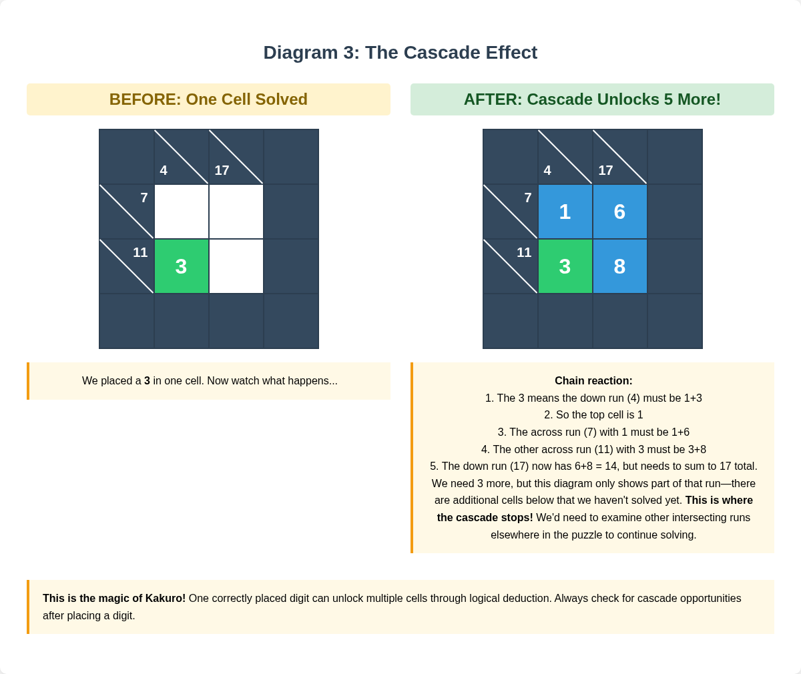
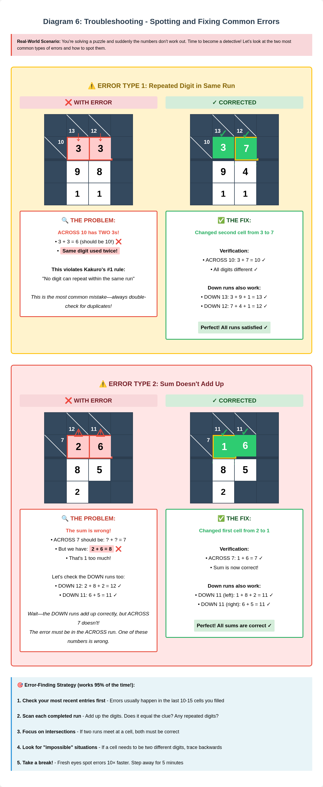

# Chapter 2: Essential Solving Techniques

You know how Kakuro works.

Now let's solve it.

Four essential techniques. Master these, and you'll breeze through beginner puzzles—with a solid foundation for harder ones.

---

## Technique 1: Unique Combinations

Your most powerful tool.

Certain sums can only be made one way. Spot them? Fill them in immediately. Complete confidence.

---

### Two-Cell Uniques

Memorize these. They're your bread and butter.

**Sum of 3:** Only 1+2
**Sum of 4:** Only 1+3
**Sum of 16:** Only 7+9
**Sum of 17:** Only 8+9

See a two-cell run with clue "3"?

You know instantly: it's 1 and 2. Maybe not which goes where yet. But you've narrowed dozens of possibilities to just two arrangements.

That's the power.

Clue of 17 across two cells? It's 8 and 9. Guaranteed. No cross-referencing needed.

---

### Non-Unique Two-Cell

Not all two-cell runs are unique. But many have few options:

**Sum of 5:** 1+4 OR 2+3
**Sum of 6:** 1+5 OR 2+4
**Sum of 7:** 1+6 OR 2+5 OR 3+4
**Sum of 15:** 6+9 OR 7+8

Knowing all possibilities = faster narrowing.

Sum of 7 in two cells? Three combinations. Check the intersecting runs. Usually one combination works.

---

### Three-Cell Uniques

Less common. Equally valuable.

**Sum of 6:** Only 1+2+3
**Sum of 7:** Only 1+2+4
**Sum of 23:** Only 6+8+9
**Sum of 24:** Only 7+8+9

Clue of 24 across three cells?

Write 7, 8, 9 into those spaces. Order comes later.

Three cells. Solved in an instant.

---

### Common Three-Cell Combos

**Sum of 8:** 1+2+5 OR 1+3+4
**Sum of 9:** 1+2+6 OR 1+3+5 OR 2+3+4
**Sum of 22:** 5+8+9 OR 6+7+9

*Complete reference: all unique combinations for 2-cell and 3-cell runs, plus common non-uniques. Green = memorize these.*

Keep it handy while learning. Soon these become second nature.

---

### Practical Application

Two runs intersect:
- Across: 2 cells, clue 17
- Down: 2 cells, clue 4

You know immediately:
- Across must be 8 and 9
- Down must be 1 and 3

The intersection cell must work for both.

What overlaps? Nothing—8, 9 don't match 1, 3.

Impossible intersection? Either you misread a clue, or miscounted cells.

Unique combinations don't just solve. They verify.

---

## Technique 2: Elimination Method

Unique combinations give instant answers.

Everything else? Systematic elimination.

Cross-reference intersecting runs. Narrow down what can go where.

---

### The Process

**Step 1:** Pick a run. List all possible digit combinations for that sum.

**Step 2:** Check each cell in that run. What intersecting runs cross through it?

**Step 3:** Remove digits that would create conflicts in intersecting runs.

**Step 4:** One possibility left? Solved.

---

### Worked Example

Let's walk through elimination step by step.

Setup:
- Across run: 3 cells, clue 15
- Down run: 2 cells, clue 9 (intersects middle cell of across run)

**Step 1:** Possibilities for 15-across-3-cells:
- 1+5+9
- 1+6+8
- 2+4+9
- 2+5+8
- 2+6+7
- 3+4+8
- 3+5+7
- 4+5+6

Lots of options. Don't panic.

*Grids 1-2: The problem setup and listing all ACROSS possibilities.*

**Step 2:** Down run (clue 9, 2 cells) possibilities:
- 1+8
- 2+7
- 3+6
- 4+5

**Step 3:** The middle cell serves both runs. Which digits work for both?

From across options, middle digits could be: 5, 6, 4, 5, 6, 4, 5, 5
From down options: 1, 8, 2, 7, 3, 6, 4, 5

Common digits: 4, 5, 6

*Grids 3-5: Listing DOWN possibilities, finding the intersection, and reaching the solution.*

Check other intersections. Narrow further. Eventually, one answer.

---

### The Cascade Effect

This is where Kakuro gets satisfying.

Place one digit with certainty.

That eliminates possibilities in its intersecting run.
Which might leave only one option there.
Which eliminates possibilities in another run.
And so on.

One breakthrough. Half the puzzle unlocked.

*Before-and-after: one digit unlocks multiple cells in a chain reaction.*

---

### When to Use Elimination

- No unique combinations visible
- You've filled some digits, need the next step
- You're stuck and need to work systematically
- You want to double-check your work

---

## Technique 3: Starting Strategies

Empty Kakuro grid.

Where do you begin?

---

### First Scan: Unique Combinations

Always.

Look for:
- Two-cell runs with clues 3, 4, 16, or 17
- Three-cell runs with clues 6, 7, 23, or 24

Mark them. Fill them in first. Even without exact order, you know which digits belong.

Crucial information for elimination.

---

### Target Short Runs

After unique combinations: focus on the shortest runs.

Two-cell runs especially.

Why? Fewer possible combinations. Easier to solve.

Two-cell run summing to 10?
- 1+9
- 2+8
- 3+7
- 4+6

Four possibilities.

Five-cell run summing to 25? Dozens of possibilities.

Start small. Build confidence. Let short runs guide you to longer ones.

---

### Corners and Edges

Puzzle constructors often put easier entry points here.

Why? Cells in corners and edges have fewer intersecting runs. Sometimes only one. Simpler to deduce.

Your scanning order:
1. All four corners
2. The edges
3. Work toward center

The center is usually the most complex. Save it.

---

### Constrained Cells

Sometimes a cell sits at the intersection of two very restrictive runs.

Sum of 3 in one direction. Sum of 4 in the other.

These heavily constrained intersections? Often only one or two possible digits.

*Green = unique combinations | Blue = short runs | Yellow stars = corners | Red circles = constrained intersections*

Golden opportunities. Check both runs simultaneously. Often one digit works.

---

### The 3-Run Rule

Once you have a few digits down:

Focus on runs where you've already filled 1-2 digits from intersections.

Partially completed runs are easier because:
- Fewer digits to place
- Known digits eliminate many combinations
- Simple arithmetic reveals the rest

Four-cell run totaling 20. You've got 7 and 9 filled in.

Remaining two cells must sum to 4.

That's 1+3.

Complex becomes trivial.

---

### When You're Truly Stuck

Tried everything?

1. **Make pencil marks.** Write tiny candidate digits where only 2-3 possibilities exist.

2. **Work backwards.** Start from a partially completed section. Trace outward.

3. **Try a different section.** Some puzzles have independent regions. Solve one, then another.

4. **Take a break.** Fresh eyes spot things you missed. Works surprisingly often.

---

## Technique 4: Advanced Tips Preview

You've got the fundamentals:
- Unique combinations
- Elimination
- Starting strategies

Now, a preview of what's ahead.

---

### Intersection Analysis

Beginner level: check one intersection at a time.

Advanced level: analyze multiple intersections simultaneously.

*Analyzing three intersecting runs at once reveals the solution faster than checking one at a time.*

Questions advanced solvers ask:
- "If I place 7 here, what happens in three directions?"
- "These two runs share two intersections—what works for both?"
- "Does this combination create an impossible situation three moves later?"

Pattern recognition at a higher level. Not just immediate conflicts. Several steps ahead.

---

### Working Backwards

Sometimes the easiest path isn't forward.

Notice a particularly constrained cell? Solve that intersection first. Even if it means leaving other areas incomplete.

**Example:**

Near the end of a puzzle:
- Run A needs sum of 6 with 2 cells remaining (1+5 or 2+4)
- Run B needs exactly 8 more in 2 cells (1+7, 2+6, or 3+5)
- They share one cell

The shared cell must work for both.

Check:
- If it's 1: Works for both (1+5=6, 1+7=8) ✓
- If it's 2: Works for both (2+4=6, 2+6=8) ✓
- If it's 5: Only first run (5+1=6, but no 5+?=8 option) ✗

Narrowed to 1 or 2. Check another intersecting run. Done.

---

### When to Guess

Let's be honest.

Expert puzzles sometimes reach a point where logic alone doesn't immediately reveal the next move.

Two choices:
1. Work through every possibility systematically (time-consuming, guaranteed)
2. Make an educated guess. See if it leads to contradiction.

Option 2 is fine. Here's how:

**Guidelines:**
- Only guess when narrowed to 2-3 possibilities
- Guess where you'll quickly see if you're wrong (lots of nearby intersections)
- Use pencil lightly
- Hit a contradiction? Backtrack immediately

Some purists say guessing isn't "real" solving.

Ignore them.

---

### The "Almost Done" Pitfall

Common scenario:

90% done. Feeling great. Last few cells seem impossible.

You made an error earlier. The math doesn't work.

**Don't panic.**

Don't erase everything.

- Check your most recent 10-15 entries first (error is usually recent)
- Verify each completed run adds up correctly
- Look for duplicate digits in the same run (most common error)

*Nearly complete puzzle with one error highlighted. Shows how to trace back and identify the mistake.*

Often it's simple. Wrote 6 instead of 8. Fix one digit. Everything falls into place.

---

### Pattern Recognition

The more puzzles you solve, the more you recognize:

- "This layout usually means the corner is 1 or 2"
- "These two clues intersecting? Almost always..."
- "This digit distribution feels wrong"

This intuition can't be taught directly.

It comes from practice.

20-30 puzzles: you start feeling it.
100 puzzles: you solve beginners in minutes without conscious thought.

---

### What's Beyond

The techniques in this chapter carry you through all beginner puzzles. Most intermediate ones too.

For expert levels:
- **Forcing chains:** If this goes here, then this forces that, which forces...
- **Sum splitting:** Dividing complex runs into sub-combinations
- **Constraint propagation:** One restriction rippling through the entire grid

Beyond beginner scope. But now you know what's possible.

---

## Putting It All Together

Four techniques in your toolkit:

1. **Unique Combinations** — Instant solutions for specific sums
2. **Elimination Method** — Narrowing possibilities through cross-reference
3. **Starting Strategies** — Finding entry points, building momentum
4. **Advanced Tips** — Thinking ahead for complex puzzles

Mastering Kakuro isn't memorizing every combination.

It's developing a feel for which technique to apply when.

That comes with practice.

---

### Your Solving Workflow

1. Scan for unique combinations. Fill them in.
2. Target short runs (2-3 cells) and corners.
3. Use elimination on intersecting runs.
4. Fill in what you've deduced.
5. Watch for the cascade effect.
6. Stuck? Try a different section. Use pencil marks.
7. Double-check completed runs before moving on.

---

## Time to Practice

The beginner puzzles start on page [XX].

Every expert Kakuro solver was once exactly where you are now.

Staring at their first empty grid.

The only difference between them and you?

Practice.

Happy solving!

